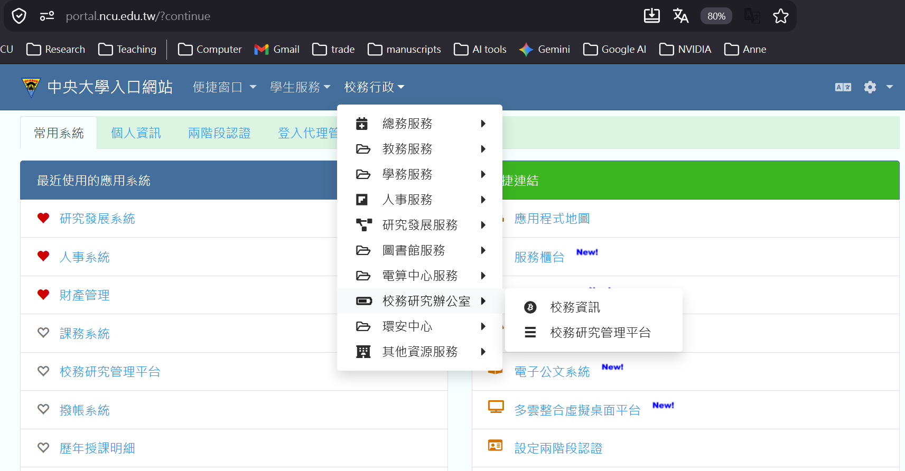

# NCU Institutional Research Data Application Guide

For NS5119 students and supervising faculty. Compiled September 10, 2026. Based on the Office of Institutional Research’s [data application instructions](https://ir.ncu.edu.tw/p/412-1034-2329.php?Lang=zh-tw), [Guidelines for Establishing and Using the Institutional Research Data System](https://ir.ncu.edu.tw/static/file/34/1034/img/404/264494950.pdf) (amended at the 793rd Administrative Meeting on June 3, 2024, ROC 113), and the platform interface inspection conducted on September 9, 2026. If the platform or rules change, the IR Office’s announcements take precedence.

*Translated September 13, 2026 from [the Chinese guide](NCU_IR_資料申請指引.md). This translation preserves the source’s instructions and verification dates; it is not a new verification of current procedures. Chinese interface labels and required wording are retained for reference. English names of forms and rules are descriptive translations.*

[English course information](README.md#english) · [English syllabus](SYLLABUS_EN.md)

## 1. Who May Apply

| Role | Access rights | Implications for this course |
| --- | --- | --- |
| Faculty and researchers | May apply directly. | The course instructor initiates the request. |
| Administrative staff | Must first ask the IR Office to enable application privileges. | Not applicable to this course. |
| Students | Cannot apply independently; a supervising faculty member must apply on their behalf. | Students are listed as “joint participants and personnel handling the data” (共同參與及處理資料人員) and sign the personnel roster, confidentiality agreement, and declaration. |

Section 2 of the guidelines limits applicants to NCU administrative units, faculty, researchers, and staff. Students’ eligibility to use the data depends on the faculty member’s application. Each participating student must therefore provide their requirements to the instructor before the application and comply with the same approved conditions afterward.

## 2. Accessing the Platform

Platform: <https://cis.ncu.edu.tw/IRSys/>. From the NCU Portal, follow:

Log in to Portal → University Administration (校務行政) → Office of Institutional Research (校務研究辦公室) → Institutional Research Management Platform (校務研究管理平台) → Public Data Platform (公開資料平台) → Integrated Query Platform (綜合查詢平台).

Four commonly used pages:

| Page | URL | Purpose |
| --- | --- | --- |
| Integrated Query Platform (綜合查詢平台) | <https://cis.ncu.edu.tw/IRSys/dataMarket/dataPlatform> | Browse the catalog and open each dataset’s request-field page. |
| Cart (採購車) | <https://cis.ncu.edu.tw/IRSys/dataMarket/dataCart> | Manage selected datasets and initiate an application. |
| Data Use Applications (資料使用申請) | <https://cis.ncu.edu.tw/IRSys/dataMarket/dataApply> | Check application status. |
| Data Download / Amendment / Closure (資料下載／異動／結案) | <https://cis.ncu.edu.tw/IRSys/dataMarket/dataHistory> | Download approved data, request changes, and close a project at the end of the use period. |

The catalog has two main sources: data transferred from university administrative systems (academic affairs, student affairs, personnel, research and development, and integrated data) and Ministry of Education university database reports. See the course’s [60-item data catalog](NCU_IR_60_Item_Data_Catalog_2026-09-09_EN.md).

## 3. Online Application Procedure

Section 4 of the guidelines specifies an entirely online review process. The applicant completes the data use application in the platform, downloads and signs the confidentiality agreement and declaration, obtains approval from the head of their unit, and then receives final review by the head of the IR Office. Approved data can be downloaded directly from the platform.

The operational sequence is as follows:

1. **Select datasets.** Open the target dataset’s field page in the Integrated Query Platform. Each page provides a checklist of fields and time selectors, which may use semesters, academic years, ROC years, Gregorian years, or ministry reporting periods. Select only the fields and periods needed for the research. Some datasets also allow restrictions by unit (限縮申請單位).
2. **Add datasets to the cart.** Click “Add dataset of interest” (加入有興趣資料集) to collect all required datasets in the cart.
3. **Submit the application.** Complete the data use application from the cart. Specify the research purpose, fields and time coverage, level of analysis, personnel handling the data, computing environment, and intended presentation of results. Download the confidentiality agreement and declaration; the applicant and every joint participant must sign. Joint participants must also complete the “Roster of Joint Participants and Personnel Handling Data” (共同參與及處理資料人員清冊).
4. **Await review.** Check the Data Use Applications page. Statuses include Data Preparation in Progress (資料建置中), Under Review (審核中), Not Approved (審核不通過), Application Completed (申請完成), Withdrawal in Progress (撤銷執行中), and Withdrawn by Applicant (自行撤銷). Applications for sensitive institutional data (校務機敏資料) also require consent from the unit responsible for those data.
5. **Download the data.** Once the status becomes Application Completed, use the Data Download / Amendment / Closure page. The platform did not specify delivery format or timing; ask about both when applying.
6. **Close the project before the use period expires.** Submit a closure report, including recommendations for the university, or feedback. Complete the “Declaration of Destruction and Deletion of Institutional Research Data” (校務研究資料銷毀、刪除切結書), obtain signatures from every joint participant, and close the project in the system. The download page states that applicants who have not closed their projects cannot apply again.

The request-field checklist is not a complete data dictionary. It generally does not provide data types, codebooks, missing-value definitions, or unique keys. Confirm these with the IR Office during the application or after approval; see Section 5.

## 4. Paper Application

In addition to the online system, applicants may complete the paper [Data System Use Application Form](https://ir.ncu.edu.tw/static/file/34/1034/img/429/801745539.docx), which includes a confidentiality agreement and usage declaration. Obtain the unit head’s signature or seal and submit it to the IR Office for review. After approval, present the application form to collect the data from the office. At closure, send the closure report and declaration to the office by email. This course primarily uses the online process, with the paper process as a fallback.

## 5. Checklist Before Submission

Specific requests can help streamline review and delivery and reduce the need for supplementary information. Check the following before submission:

- **Research question and unit of analysis.** State the question, intended decision-maker, and what each row represents: a person, an occurrence, a course, or a unit × period.
- **Datasets and fields.** List each dataset, selected fields, and time range. Prefer aggregate data; request individual records only where necessary.
- **Time-code meanings.** Period codes are inconsistent across the platform, such as `1141` and `11403`. An available option does not establish that the period’s data are complete. List the requested periods and ask the IR Office to confirm completeness and any definition changes.
- **Linkage requirements.** Explain which keys are needed for cross-dataset linkage and whether the administrators could first produce aggregate tables to avoid unnecessary individual records.
- **Joint participants.** List every student and assistant who will access the data. Prepare a confidentiality agreement, declaration, and roster entry for each person.
- **Computing environment and tools.** Explain where the data will be stored and whether they will be entered into AI tools or used to build a retrieval index. The guidelines prohibit copying data or providing them to people outside the research team. Do not send the data to external services without permission.
- **Scope of presentation.** Describe which aggregate results will appear in competition reports, posters, and final deliverables, and whether those results will be public.

The course’s draft request for 學29, course offering data, and 學9—including fields and periods—is in Section 7 of the [data inventory and topic assessment](NCU_IR_Data_Inventory_and_Topic_Assessment_2026-09-09_EN.md) and can serve as a starting point.

## 6. Obligations After Approval

The following summarizes Section 5 of the guidelines. Violations may affect future approvals and may entail legal liability.

- Comply with the Personal Data Protection Act. Do not publish original data externally, use them for other purposes, link them with other data to identify individuals, or use them to identify individual units. These obligations continue after leaving employment or graduating.
- Do not copy the data by any means or provide them to people outside the research team.
- The data system’s version governs the data and information content. Applicants are responsible for any alteration or concealment.
- Before publishing research based on these data, obtain review and approval from the IR Office and relevant committee members.
- Acknowledge the data source when publishing, using the prescribed statement: 「本研究部分資料來源為國立中央大學校務研究資料系統，文中任何闡釋或結論並不代表國立中央大學之立場。」 A descriptive English translation is: “Some data used in this study were obtained from the National Central University Institutional Research Data System. Any interpretations or conclusions in this work do not represent the position of National Central University.” The English translation is not presented as an approved substitute for the prescribed Chinese wording. Provide the office with an offprint or electronic copy within one month of publication or presentation.
- Before the approved use period expires, submit a closure report or feedback, sign the destruction declaration, and complete project closure.

The source guide treats competition reports, posters, and final research packages as presentations of research findings; allow time for office review before submission.

## 7. Application Schedule for This Course

| Timing | Task | Responsible parties |
| --- | --- | --- |
| Week 2 (09/17) | Each team submits its data requirements: datasets, fields, periods, level of analysis, and personnel handling the data. | Students |
| Weeks 2–3 | Consolidate requirements and apply through the platform; students sign the confidentiality agreement, declaration, and roster. | Instructor and students |
| Week 4 (10/01) | Data feasibility checkpoint. If essential data have not arrived, narrow the scope, use aggregate or public data, or adopt a data discovery or checking tool as the project. | Instructor and students |
| After approval | Store data only in the approved environment; record each processing step and version in the research journal. | Students |
| Before 11/16 | Send the competition report to the IR Office for review, then submit it by the official deadline. | Instructor and students |
| End of semester (12/24) | Submit the final research package; complete the closure report and destruction declaration according to the approved use period. | Instructor and students |

While awaiting approval, work on the literature, methods, and workflow design. Synthetic data may be used for development and demonstration, but must be clearly labeled and cannot be presented as empirical findings about NCU.

## 8. Contact Information

Office of Institutional Research, No. 300, Zhongda Road, Zhongli District, Taoyuan City. Telephone: 03-422-7151, extension 27045. Email: ncu27075@ncu.edu.tw.
